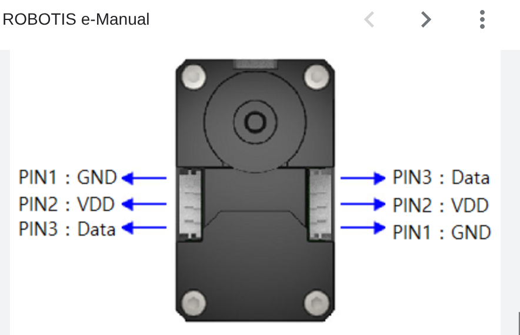

# DYNAMIXEL XL-330 Motor Connector Specifications

The DYNAMIXEL XL-330 uses a **3-pin JST-GH family connector** on the servo PCB.

## Key Characteristics
- **Pins**: 3 pins in a single row
- **Pitch**: 1.25 mm (Note: User mentioned 2.54mm but JST-GH is 1.25mm; Robotis XL330 uses 1.25mm JST-GH)
- **Locking**: Friction lock latch on the housing
- **Polarization**: Keyed housing to prevent reverse mating
- **Often called**: JST GH series (Note: XH is incorrect — GH is the one Robotis uses)

📌 **Why This Matters**: Generic servo wires (like typical RC servo cables) will not lock in reliably. They can wiggle out over time inside mechanical motion systems like the Orbigator globe.

---

## 🔌 Recommended Connector Components

### 1. JST-GH Crimp Housings (3-pin)
Use these on the servo cable that mates to the XL-330.
- **Part**: JST GHR-03V-S (3-pin housing)
- **Verified Link**: [DigiKey - GHR-03V-S](https://www.digikey.com/en/products/detail/jst-sales-america-inc/GHR-03V-S/2978418)
- **Features**: Designed for movement without loosening.

### 2. JST-GH Crimp Pins (for cable ends)
You must use crimp pins made specifically for the GH series (26-30 AWG).
- **Part**: JST SSHL-002T-P0.2
- **Verified Link**: [DigiKey - SSHL-002T-P0.2](https://www.digikey.com/en/products/detail/jst-sales-america-inc/SSHL-002T-P0.2-608779/608779)
- **Important**: Crimp them onto your wires with a proper tool — do not solder directly to the housing.

### 3. JST-GH PCB Mounting Headers
If you are designing your own PCB or breakout board, use these SMT headers to mate with the servo cables.
- **Top Entry (Vertical)**: [JST BM03B-GHS-TBT](https://www.digikey.com/en/products/detail/jst-sales-america-inc/BM03B-GHS-TBT/608693)
- **Side Entry (Horizontal)**: [JST SM03B-GHS-TB](https://www.digikey.com/en/products/detail/jst-sales-america-inc/SM03B-GHS-TB-LF-SN/2978459)
- **Note**: These are SMT (Surface Mount) components. Through-hole versions are not standard for the GH series.

### 4. Matching Servo Cable Assemblies
Pre-assembled 3-wire GH connector cables (often sold as Robotis servo harnesses).
- **Example**: [Robotis 500mm Extension Cable](https://www.robotis.us/robot-cable-wp-500mm-extension-cable/)
- **Robotis P/N**: Robot Cable-WP 3P 500mm

---

## 🛠 Tips to Keep Them Secure Inside the Globe

### A) Use strain relief
Even with locking connectors, tension from motion can pull wires. Always add:
- Hot-glue at strategic anchor points
- Adhesive cable clips
- Zip-ties to internal standoffs
This prevents mechanical load on the small JST latch.

### B) Don’t rely on bare headers
Avoid using bare pins without a housing inside the globe. Vibration will eventually shake them loose.
- **Always use**: Crimped GH housing on the wire side mated to the servo board.

### C) Board Design
If you’re designing your own daughterboard or breakout:
- Use headers that friction-lock with JST-GH.
- Add a small retention clip or silkscreen guidance to ensure the connector is captive.
