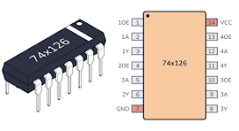

# DYNAMIXEL Motor Setup - Dry Lab Walkthrough

## 🎯 Overview
This guide walks you through setting up your DYNAMIXEL XL330-M288-T motors for the Orbigator project. Since the motors arrived with self-tapping screws (bonus!), we can skip sourcing those.

---

## 📦 Parts Inventory Check

### What You Should Have:
- ✅ **2× DYNAMIXEL XL330-M288-T servos** (just arrived!)
- ✅ **Self-tapping screws** (came with motors)
- ✅ **1× SN74HC126N tri-state buffer IC**
- ✅ **1× 10kΩ resistor** (pull-up for DATA line)
- ✅ **1× Raspberry Pi Pico 2**
- ✅ **1× 5V 4-5A power supply** (for servos)
- ✅ **Breadboard and jumper wires**
- ✅ **3D printed drive shaft adapter** (currently printing with updated dimensions)

---

## 🔧 Phase 1: Initial Inspection & Preparation

### 1.1 Identify Wire Pins (Wires Not Color-Coded!)
**IMPORTANT:** Your motors have unmarked wires. Identify pins BEFORE connecting power!

See [`DYNAMIXEL_PIN_DIAGRAM.md`](file:///home/justin/.gemini/antigravity/brain/357765be-9559-47f3-8ceb-0ed9de1921a9/DYNAMIXEL_PIN_DIAGRAM.md) for detailed instructions.

**CRITICAL: Connectors are MIRRORED!** Pin 1 (GND) is always on the outer edge:


**Quick method using multimeter:**
- [ ] Set multimeter to continuity mode
- [ ] Touch one probe to motor case/mounting holes
- [ ] Touch other probe to each wire
- [ ] The wire that beeps = **GND (Pin 1)** - always on outer edge!
- [ ] Label with black tape: "GND"
- [ ] Middle pin = **VDD (+5V)** - label with red tape
- [ ] Inner pin = **DATA** - label with yellow tape

### 1.2 Inspect the Motors
- [ ] Unpack both DYNAMIXEL servos
- [ ] Verify the horn thickness (you mentioned it's thinner than expected)
- [ ] Check that both motors have:
  - Two 3-pin JST connectors (one on each side - both identical!)
  - White output horn attached
  - Mounting holes visible on sides
- [ ] Inventory the self-tapping screws that came with them

### 1.2 Measure Horn Dimensions
Since you found the horn is thinner than expected:
- [ ] Measure actual horn height with calipers
- [ ] Update `horn_height` in `dynamixel_motor.scad` if needed
- [ ] Note: Current model has `horn_height = 2.8` mm (line 19)
- [ ] If different, update and re-render drive shaft adapter

### 1.3 Test Drive Shaft Fit (After Print Completes)
- [ ] Let drive shaft print finish
- [ ] Test fit on motor horn (should be snug)
- [ ] Verify mounting holes align with horn holes
- [ ] Check that D-shaft profile is correct

---

## ⚡ Phase 2: Electrical Setup

### 2.1 Gather Electronic Components
- [ ] SN74HC126N IC
- [ ] 10kΩ resistor
- [ ] Breadboard
- [ ] Jumper wires (various colors for organization)
- [ ] Raspberry Pi Pico 2
- [ ] 5V power supply with appropriate connector

### 2.2 Understanding the 74x126 Tri-State Buffer

The **SN74HC126N** (or 74x126 family) is a quad tri-state buffer that enables half-duplex communication with DYNAMIXEL servos. We only use one of the four buffers (gate 1).



#### Why Do We Need This?

DYNAMIXEL servos use **half-duplex UART** - a single DATA wire for both transmit (TX) and receive (RX). The Pico has separate TX and RX pins, so we need the buffer to:
1. **Connect Pico TX to DATA** when transmitting (buffer enabled)
2. **Disconnect Pico TX from DATA** when receiving (buffer tri-stated/high-Z)
3. **Allow Pico RX to always listen** on DATA line

#### Pin Functions (14-pin DIP):

| Pin | Name | Function | Connection |
|-----|------|----------|------------|
| 1 | 1OE | Output Enable (Gate 1) | GP2 (Direction Control) |
| 2 | 1A | Input (Gate 1) | GP0 (UART TX) |
| 3 | 1Y | Output (Gate 1) | DATA BUS |
| 4 | 2OE | Output Enable (Gate 2) | Not used |
| 5 | 2A | Input (Gate 2) | Not used |
| 6 | 2Y | Output (Gate 2) | Not used |
| 7 | GND | Ground | GND rail |
| 8 | 3Y | Output (Gate 3) | Not used |
| 9 | 3A | Input (Gate 3) | Not used |
| 10 | 3OE | Output Enable (Gate 3) | Not used |
| 11 | 4Y | Output (Gate 4) | Not used |
| 12 | 4A | Input (Gate 4) | Not used |
| 13 | 4OE | Output Enable (Gate 4) | Not used |
| 14 | VCC | Power Supply | 3.3V from Pico |

#### How It Works:

```
Direction Control (GP2):
  HIGH (1) → Buffer ENABLED  → 1Y outputs 1A signal → Pico transmits to DATA
  LOW  (0) → Buffer TRI-STATE → 1Y is high-Z       → Servo transmits on DATA

Pico RX (GP1) is always connected to DATA to receive responses.
```

### 2.3 Build the Interface Circuit

**Reference:** See `DYNAMIXEL_WIRING_DIAGRAM.txt` for complete ASCII diagram

#### Step-by-step wiring:

**A. Place the 74HC126 on breadboard:**
```
Pin 1  (1OE)  ← GP2 (Direction Control)
Pin 2  (1A)   ← GP0 (UART TX)
Pin 3  (1Y)   → DATA BUS
Pin 7  (GND)  ← GND
Pin 14 (VCC)  ← 3.3V from Pico
```

**B. Create the DATA BUS:**
- [ ] Connect 74HC126 Pin 3 to a breadboard rail (this is DATA)
- [ ] Connect GP1 (Pico RX) to same DATA rail
- [ ] Add 10kΩ resistor from DATA rail to 5V rail (pull-up)

**C. Power connections:**
- [ ] Connect Pico GND to breadboard GND rail
- [ ] Connect Pico 3.3V to breadboard 3.3V rail (for 74HC126)
- [ ] Connect external 5V supply GND to breadboard GND rail
- [ ] Connect external 5V supply +5V to breadboard 5V rail

**D. Verify before connecting servos:**
- [ ] Double-check all connections against diagram
- [ ] Ensure common ground between Pico and 5V supply
- [ ] Verify 74HC126 has 3.3V on pin 14
- [ ] Verify DATA line has 10kΩ pull-up to 5V

---

## 🆔 Phase 3: Configure Servo IDs (ONE AT A TIME!)

> **CRITICAL:** Only connect ONE servo at a time during ID configuration!

### 3.1 Upload Setup Script to Pico
- [ ] Connect Pico to computer via USB
- [ ] Copy `micropython/dynamixel_setup.py` to Pico
- [ ] Open Thonny or your preferred MicroPython IDE
- [ ] Verify script is on Pico

### 3.2 Configure First Servo (EQX Motor - ID 1)

**Connect ONLY the first servo:**
- [ ] Take ONE servo
- [ ] Connect its 3-pin JST connector:
  - Black wire → GND rail
  - Red wire → 5V rail
  - Yellow wire → DATA rail
- [ ] Power on the 5V supply
- [ ] Power on the Pico

**Run configuration:**
```python
# In Thonny/REPL
from dynamixel_setup import *

# Scan to find current ID
scan_servos()
# Note the ID it reports (probably 1 if factory default)

# If not ID 1, change it:
change_id(current_id, 1)

# Verify
ping(1)
# Should respond with model and firmware info
```

- [ ] Mark this servo with tape/label: "EQX - ID 1"
- [ ] Disconnect servo from power

### 3.3 Configure Second Servo (AOV Motor - ID 2)

**Disconnect first servo, connect second:**
- [ ] Disconnect first servo completely
- [ ] Connect second servo to same DATA/5V/GND rails
- [ ] Power on

**Run configuration:**
```python
# Scan for this servo
scan_servos()

# Change to ID 2
change_id(current_id, 2)

# Verify
ping(2)
```

- [ ] Mark this servo with tape/label: "AOV - ID 2"
- [ ] Disconnect servo

---

## 🔌 Phase 4: Daisy-Chain Connection

Now both servos have unique IDs, connect them together:

### 4.1 Wire Both Servos
- [ ] Connect Servo 1 (ID 1 - LAN) to breadboard:
  - Black → GND
  - Red → 5V
  - Yellow → DATA
- [ ] Connect Servo 2 (ID 2 - AOV) to same rails:
  - Black → GND (shared)
  - Red → 5V (shared)
  - Yellow → DATA (shared)

### 4.2 Verify Communication
```python
# Scan should find both
scan_servos()
# Should report: Found servo at ID 1, Found servo at ID 2

# Ping each individually
ping(1)
ping(2)

# Both should respond!
```

---

## 🧪 Phase 5: Functional Testing

### 5.1 Basic Movement Test
```python
# Test Servo 1 (EQX Motor)
set_torque(1, True)
set_position(1, 2048)  # Center position
time.sleep(1)
read_position(1)

set_position(1, 1024)  # Quarter turn
time.sleep(1)
read_position(1)

set_position(1, 3072)  # Three-quarter turn
time.sleep(1)
read_position(1)

# Disable torque (motor can be moved by hand)
set_torque(1, False)
```

### 5.2 Test Second Motor
```python
# Test Servo 2 (AOV Motor)
set_torque(2, True)
set_position(2, 2048)
time.sleep(1)
read_position(2)

# Try different position
set_position(2, 0)
time.sleep(1)
read_position(2)

set_torque(2, False)
```

### 5.3 Test Both Simultaneously
```python
# Enable both
set_torque(1, True)
set_torque(2, True)

# Move both to center
set_position(1, 2048)
set_position(2, 2048)
time.sleep(2)

# Move in opposite directions
set_position(1, 1024)
set_position(2, 3072)
time.sleep(2)

# Verify positions
read_position(1)
read_position(2)
```

---

## 🔩 Phase 6: Mechanical Assembly

### 6.1 Install Drive Shaft Adapter
Once your 3D print completes:

- [ ] Remove horn from Servo 1 (if needed for access)
- [ ] **CRITICAL: Check screw length!**
  - Measure horn height with calipers (should be ~2.8mm)
  - Adapter base is 3.2mm thick
  - **Maximum safe screw length = adapter_base + horn_height - 0.5mm safety margin**
  - For default values: 3.2 + 2.8 - 0.5 = **5.5mm max**
  - ⚠️ **Screws longer than this will bottom out on motor body and cause damage!**
- [ ] Place drive shaft adapter over horn
- [ ] Align mounting holes (4 holes at 90° intervals)
- [ ] Insert self-tapping screws through adapter into horn
- [ ] Tighten screws evenly until snug (don't over-torque!)
- [ ] **Stop immediately if screw bottoms out** - use shorter screws
- [ ] Verify adapter is secure and centered

### 6.2 Test Mechanical Range
```python
# Enable torque
set_torque(1, True)

# Slowly sweep through range
for pos in range(0, 4096, 100):
    set_position(1, pos)
    time.sleep(0.1)
    
# Check for binding or mechanical issues
set_torque(1, False)
```

### 6.3 Mount to Orbigator Frame
- [ ] Position motor in Orbigator assembly
- [ ] Use mounting holes on motor body (16mm × 30mm spacing)
- [ ] Secure with appropriate screws/standoffs
- [ ] Verify motor can rotate freely
- [ ] Check cable routing (don't pinch wires!)

---

## 📊 Phase 7: Calibration & Integration

### 7.1 Find Physical Limits
```python
# With motor mounted, find mechanical limits
set_torque(1, True)

# Slowly move to find min position
# Watch for mechanical stops!
set_position(1, 0)

# Find max position
set_position(1, 4095)

# Record actual usable range for your assembly
```

### 7.2 Map to Orbital Parameters
For Orbigator, you need to map servo positions to orbital angles:

### **Quick Reference:**
- Servo 1 (ID=1): **EQX Motor** (Equator crossing)
- Servo 2 (ID=2): **AoV Motor** (Argument of Vehicle - orbital position)
  - 0° = Satellite crosses equator northbound
  - 90° = Maximum latitude
  - 180° = Satellite crosses equator southbound
  - 270° = Minimum latitude

```python
def angle_to_position(angle_deg):
    """Convert angle (0-360°) to servo position (0-4095)"""
    return int((angle_deg / 360.0) * 4095)

def position_to_angle(position):
    """Convert servo position to angle"""
    return (position / 4095.0) * 360.0

# Test
set_position(1, angle_to_position(90))   # 90° LAN
set_position(2, angle_to_position(180))  # 180° AOV
```

### 7.3 Update Orbigator Code
Replace stepper motor functions with DYNAMIXEL commands:

**Old:** `lan_move_steps(steps)`  
**New:** `lan_set_angle(angle_deg)`

**Old:** `aov_move_steps(steps)`  
**New:** `aov_set_angle(angle_deg)`

---

## ✅ Final Checklist

### Electrical
- [ ] Both servos respond to ping
- [ ] IDs are correct (1 and 2)
- [ ] No communication errors
- [ ] Direction control working (GP2)
- [ ] Pull-up resistor in place

### Mechanical
- [ ] Drive shaft adapter fits properly
- [ ] Screws secure (self-tapping worked!)
- [ ] No binding in rotation
- [ ] Motors mounted to frame
- [ ] Cables routed safely

### Software
- [ ] `dynamixel_setup.py` working
- [ ] Can read positions
- [ ] Can set positions
- [ ] Torque enable/disable works
- [ ] Both motors respond independently

### Integration
- [ ] Orbital angle mapping defined
- [ ] Orbigator code updated
- [ ] Calibration values recorded
- [ ] Ready for orbital calculations!

---

## 🚨 Troubleshooting

### No Response from Servo
- Check power (5V supply on?)
- Verify DATA line pull-up (10kΩ to 5V)
- Check direction control (GP2 toggling?)
- Try different baud rate (default 57600)

### Wrong ID Detected
- Only one servo connected during ID change?
- Use `scan_servos()` to find current ID
- Use `change_id(old, new)` to fix

### Mechanical Binding
- Check drive shaft adapter alignment
- Verify screws not over-tightened
- Ensure no interference with frame
- Test with torque disabled (manual rotation)

### Communication Errors
- Verify common ground
- Check 74HC126 wiring
- Ensure UART pins correct (GP0=TX, GP1=RX)
- Try lower baud rate

---

## 📚 Reference Documents

- `ORBIGATOR_COMPLETE_WIRING.txt` - Full system wiring
- `DYNAMIXEL_WIRING_DIAGRAM.txt` - ASCII circuit diagram  
- `DYNAMIXEL_Quick_Reference.md` - One-page cheat sheet
- `micropython/dynamixel_setup.py` - Configuration script
- `fabricate/dynamixel_motor.scad` - 3D model

---

**Good luck with your setup! The motors are going to be perfect for precise orbital positioning! 🚀**
