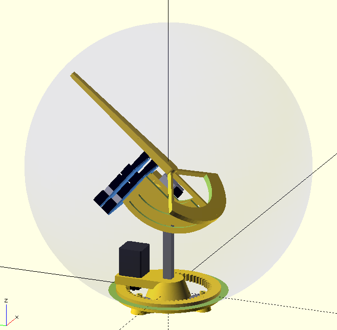

# Orbigator – An Analog Orbit Propagator

## About This Project

Orbigator is an open‑source mechanical model that physically demonstrates how a satellite orbits the Earth. It uses a Raspberry Pi Pico 2 and precision DYNAMIXEL servo motors to move a pointer around a real globe, tracking a satellite's ground track in real-time.

The system computes complex orbital mechanics—including Kepler's laws and J2 perturbation effects—to determine the satellite's instantaneous position relative to the Earth's surface.

## Key Features (V1.1 Dec 2025)

The project has recently reached a major milestone with the implementation of a modern, mode-based architecture:

- **Zulu Time Display**: Real-time tracking is represented in Zulu (UTC) format on the OLED display (e.g., `13:24:11Z`).
- **Dynamic Orbital Inclination**: The J2 precession formula now accounts for user-settable inclination (0.1° precision), allowing accurate tracking of ISS (51.6°), Sun-Sync, or Polar orbits.
- **Revolution-Based Persistence**: To protect the Pico 2 flash memory, orbital state is saved precisely once per full motor revolution.
- **Shortest-Path Catch-up**: On power-up, the system calculates the time elapsed via the RTC and performs an efficient "chase" move (max 180°) to sync to the current orbital target.
- **Hardware Safety**: Stict motor speed limits (Safety Max = 10) protect the mechanical assembly and ensure magnets stay securely on the globe.
- **RTC Reset Protection**: On boot, if the clock is detected as reset (e.g. dead battery), the system automatically prompts you to set the Zulu time before starting tracker operations.
- **Manual Motor Alignment**: New "Set EQX" and "Set AoV" modes in the Settings menu allow for precise, real-time manual positioning of the motors for initial calibration or testing.
- **Intuitive UI**: Consistent encoder logic (Clockwise = Navigate Down / Increase Value) and a safety-locked "Confirm" button during tracking.

## How It Works

- **Compute** – Raspberry Pi Pico 2 running MicroPython executes the orbital equations. Main logic is in `micropython/orb_utils.py`.
- **Actuate** – DYNAMIXEL XL330-M288-T motors using Extended Position Control (Mode 4) for continuous, turn-preserving rotation.
  - **Motor ID 1 (EQX)**: Rotates the orbital plane (Equator Crossing / LAN).
  - **Motor ID 2 (AoV)**: Direct-drive for the satellite pointer's anomaly.
- **Interface** – SH1106 OLED display for status and menus, rotary encoder for adjustment, and DS3231 RTC for accurate timekeeping.

## Repository Structure

| Directory | Contents |
|-----------|----------|
| `micropython/` | Firmware: `orbigator.py` (main), `modes.py` (UI), `orb_utils.py` (logic), `dynamixel_motor.py` (driver) |
| `fabricate/` | OpenSCAD source files for 3D printing and full assembly |
| `kicad/` | PCB design files, schematics, and manufacturing outputs |
| `images/` | Renderings and fabrication drawings |

## Key Documentation

- [ORBIGATOR_PIN_ASSIGNMENTS.txt](ORBIGATOR_PIN_ASSIGNMENTS.txt) - Complete GPIO pin assignments for Pico 2
- [ORBIGATOR_CIRCUIT_DIAGRAM.txt](ORBIGATOR_CIRCUIT_DIAGRAM.txt) - ASCII circuit diagram showing all connections
- [orbigator_kicad_netlist.py](orbigator_kicad_netlist.py) - KiCad-compatible netlist for schematic creation
- [DYNAMIXEL_DRYLAB_SETUP.md](DYNAMIXEL_DRYLAB_SETUP.md) - Comprehensive guide to motor configuration and wiring
- [EXTENDED_POSITION_MODE_GUIDE.md](EXTENDED_POSITION_MODE_GUIDE.md) - Best practices for continuous rotation
- [SPEED_LIMIT_QUICKREF.md](SPEED_LIMIT_QUICKREF.md) - Critical safety guidelines for motor speeds
- [DYNAMIXEL_CONNECTOR_SPECS.md](DYNAMIXEL_CONNECTOR_SPECS.md) - Pinout and connector details for XL-330 servos

## Getting Started

1. **Hardware**: Pulse-check the `ORBIGATOR_PIN_ASSIGNMENTS.txt` and `ORBIGATOR_CIRCUIT_DIAGRAM.txt`.
2. **Firmware**: Upload the `micropython/` directory to your Pico 2.
3. **Time**: Use `mpremote setrtc` to synchronize the clock.
4. **Orbit**: Select "Orbit!" from the menu to start tracking. Use the "Settings" menu to adjust altitude and inclination.

## License
MIT License.
