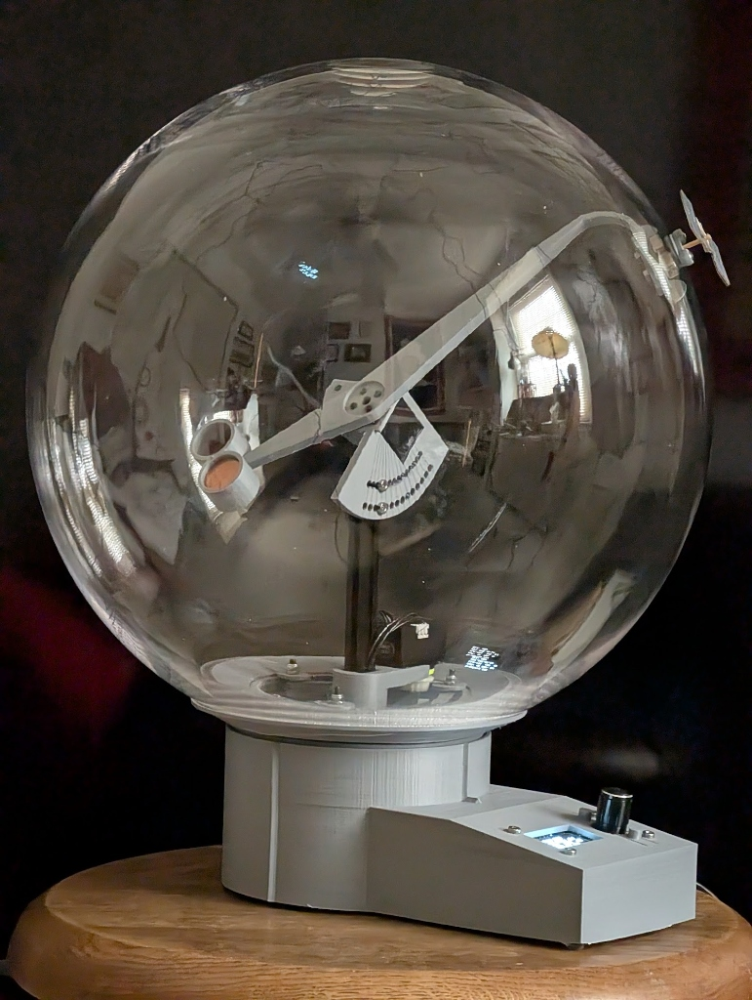
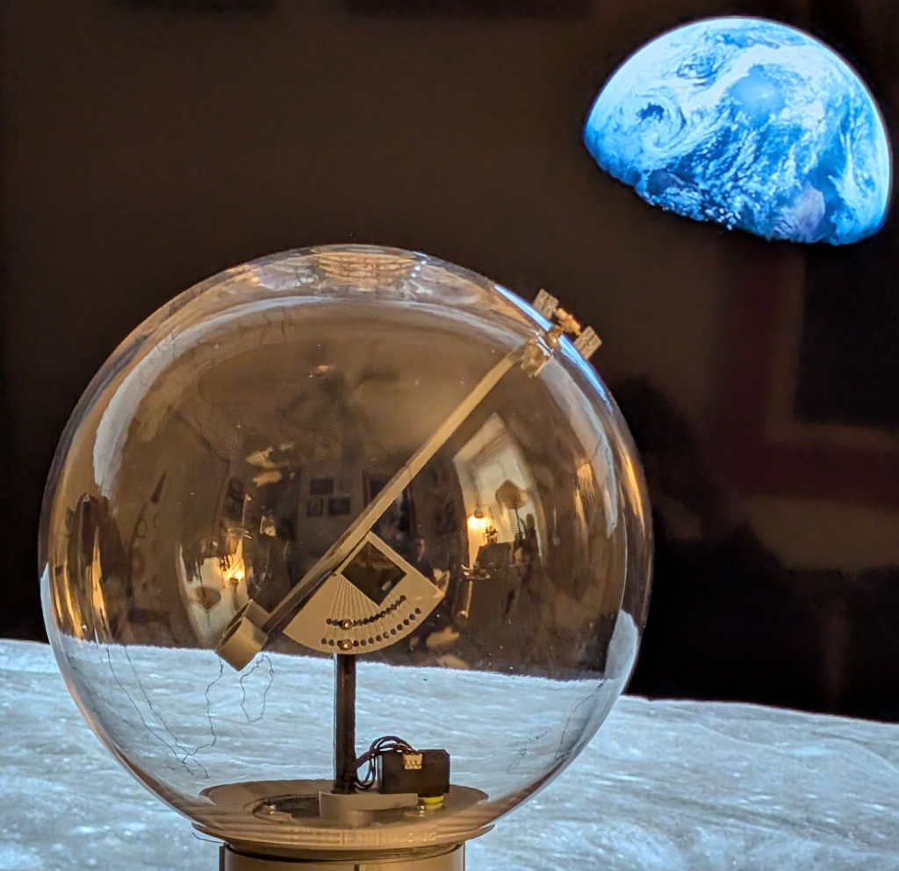
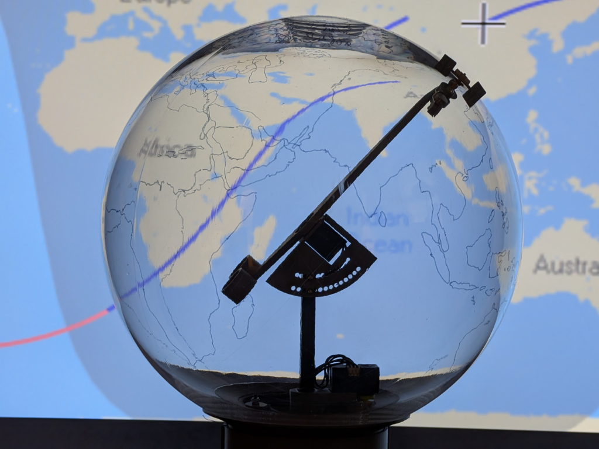
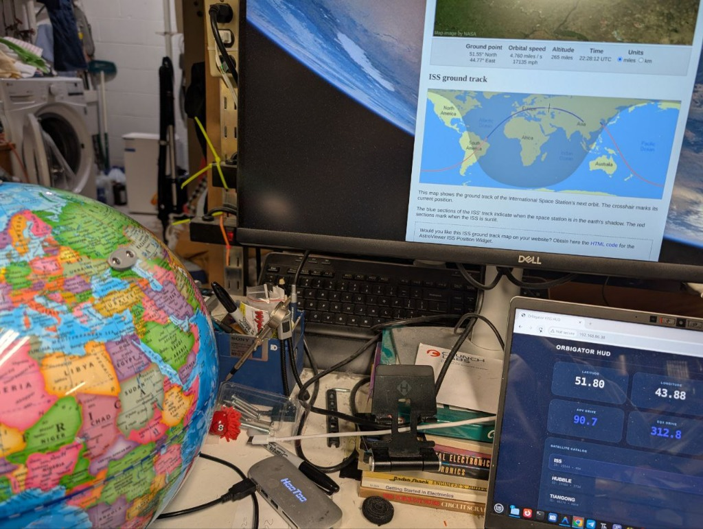
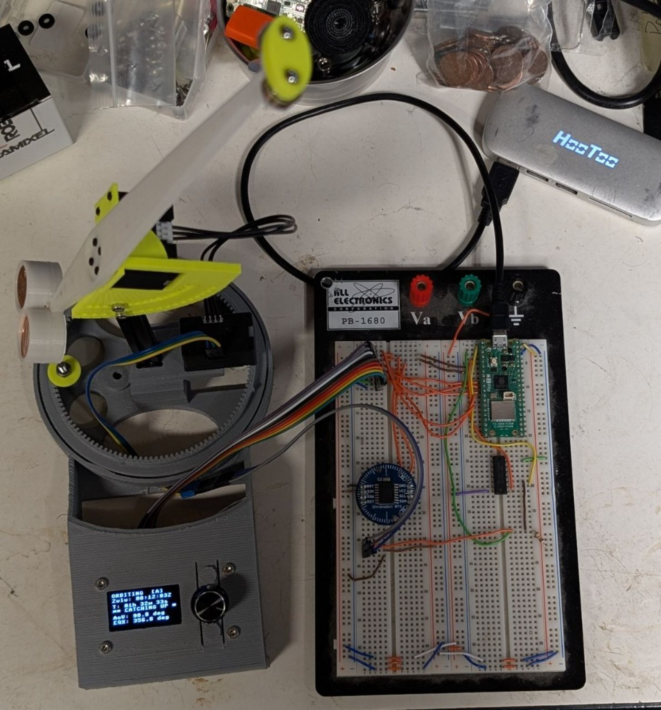
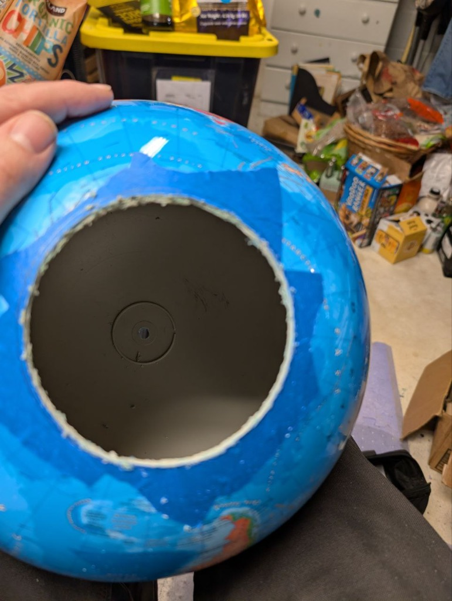
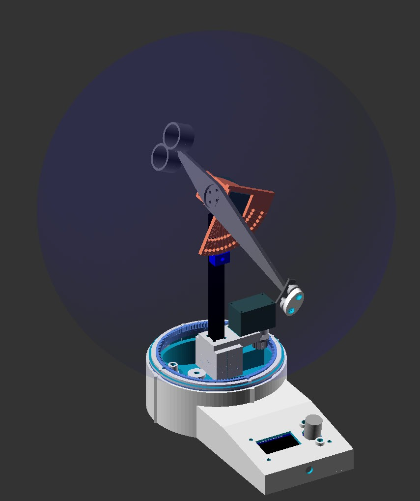

# 🌍 Orbigator: The Analog Orbit Propagator

> "What hardware hacker doesn’t have a soft spot for transparent cases? ... [wyojustin] has done a fantastic job of documenting the hardware and software aspects of the build." — **[Hackaday](https://hackaday.com/2026/03/08/the-orbigator-satellite-tracking-with-style/)**

**The Orbigator** is an open-source, physical satellite tracker that turns complex orbital mechanics into a desk-side companion. Powered by the **Raspberry Pi Pico 2** and precision **DYNAMIXEL servos**, it physically points to the ISS (or any satellite) in real-time with zero drift.

---

## 🚀 Why the Orbigator?

Inspired by [Will’s Builds ISS tracker](https://hackaday.com/2025/07/08/touch-lamp-tracks-iss-with-style/), the Orbigator introduces several key technical innovations to the DIY tracker space:

### 🔄 Continuous, Uninterrupted Motion
Unlike traditional trackers that use static globes (requiring wire unwinding every orbit), the Orbigator features a **rotating globe**. This allows for smooth, continuous tracking across multiple revolutions without ever needing to reset or "unwind."

### 🎯 LVLH Attitude Control
The orbital mechanics are implemented directly in the hardware geometry (inclination angle). This ensures the satellite pointer maintains a true **LVLH (Local Vertical, Local Horizontal)** attitude throughout the entire pass—exactly how real satellites orient themselves.

### 🧩 Zero-Drift absolute Positioning
Leveraging the 32-bit absolute resolvers in DYNAMIXEL XL330-M288-T motors, the system recovers its orientation instantly after power cycles. No homing, no limits, and no drift—just persistent, mathematical accuracy.

---

## 🛠️ Technical Deep Dive

*Complete Mechanical Assembly: Precision motion and integrated control.*

### Lightweight, High-Performance Propagator
The heart of the Orbigator is a custom, **lightweight SGP4 implementation** running natively on the Pico 2's RISC-V cores. Eschewing heavy ports, it was rolled specifically to provide mathematical accuracy within the visual tolerances of the physical hardware, handling real-time TLE propagation and J2 perturbation effects entirely in MicroPython.

### Split-Screen Radar UI
A custom **SH1106 OLED driver** provides a powerful command center:
*   **Live Radar Plot**: A dynamic "Sky Plot" of the current satellite pass.
*   **Localized World Map**: High-speed bitmask rendering provides a 90° ground track view centered on your observer location.

### Smart Persistence
The system monitors its own state and saves to Flash/SRAM only during ideal intervals (e.g., at equator crossings) to maximize flash lifespan while ensuring a perfect "instant-on" recovery.

---

## 📦 Repository Structure

| Path | Description |
|------|-------------|
| [**micropython/**](micropython/) | Firmware: SGP4 propagator, UI stacks, and motor drivers. |
| [**fabricate/**](fabricate/) | Mechanical design: OpenSCAD files for 3D printing and assembly. |
| [**kicad/**](kicad/) | Electronics: PCB designs and schematics. |
| [**web/**](micropython/web/) | Dashboard: Real-time control and configuration via web interface. |

---

## ⚡ Quick Start

1.  **3D Print**: High-quality production STLs are located in [**fabricate/stls/Production/**](fabricate/stls/Production/).
2.  **Assemble**: Follow the assembly logic in the [fabricate/](fabricate/) folder.
3.  **Flash MicroPython**: Install the Pico 2 firmware.
4.  **Upload Code**: Use Thonny or `mpremote` to copy the `micropython/` files to the board.
5.  **Track!**: Power up and select your satellite from the "SGP4" menu.

---

## 🧾 Bill of Materials (BOM)

### Electronics
*   **Controller**: [Raspberry Pi Pico 2W](https://www.adafruit.com/product/6087)
*   **Motors**: 2x [DYNAMIXEL XL330-M288-T](https://robotis.us/dynamixel-xl330-m288-t/)
*   **Display/UI**: [I2C OLED Display with EC11 Rotary Encoder](https://www.crcibernetica.com/i2c-oled-display-with-ec11-rotary-encoder/)
*   **RTC**: [DS3232 Precision RTC](https://www.dfrobot.com/product-2304.html)
*   **Logic**: 1x [SN74HC126N Quad Tri-State Buffer](https://www.digikey.com/en/products/detail/texas-instruments/SN74HC126N/376889) (for half-duplex UART)
*   **UI Extras**: 2x Momentary Push Buttons
*   **Passives**: 1x 10kΩ resistor, 2x 4.7kΩ resistors
*   **Power**: 5V 4-5A External Power Supply with [5.5mm DC Barrel Jack](https://www.amazon.com/dp/B0D9B7WR23)

### Hardware & Mechanical
*   **Globe**: [12" Transparent Desktop Globe](https://www.amazon.com/dp/B0086OHL9A)
*   **Bearings**: 3x [13mm OD Carbon Steel Ball Bearings](https://www.amazon.com/dp/B07SV6QSR3) (e.g., 624ZZ) and [High-Performance Skate Bearings](https://www.amazon.com/dp/B09MPMW1XQ)
*   **Fasteners**: Self-tapping screws (included with motors), [M3 Male Stud Mounting Magnets](https://www.kjmagnetics.com/mm-c-12-neodymium-male-stud-mounting-magnet?pl=1.2&pf=), and [Tension Springs](https://www.amazon.com/dp/B076LZ8L1M)
*   **Hardware**: 10-20 US pennies (used as counterweight)
*   **3D Parts**: Printed from the `Production/` folder (PLA or PETG)

---

## 📐 3D Printing (Production Parts)

The following parts are required for the full assembly and can be found in `fabricate/stls/Production/`. **The leading number in the filename indicates the required print quantity.**

*   `1_drive_gear.stl` - Main EQX drive
*   `1_flex_aov_arm.stl` - Satellite pointer arm
*   `1_globe_interface.stl` - Secure mount for the globe
*   `1_inclination_aov_mount.stl` - Hardware-implemented inclination bracket
*   `1_sled_3.stl` - Electronic housing and base
*   `1_full_assembly.stl` - Reference model (not for printing)
*   `3_swingarm.stl` - Differential assembly components
*   `3_shim.stl` - Insert for the skate bearings (see `misc.scad` for 13mm dims)
*   `3_washer.stl` - Vertical stop for the ring gear

---

## 📸 Media: As Seen on [WyoLum Blog](https://wyolum.com/orbigator-real-time-satellite-tracker-with-overhead-alert-radar/)

| [**Earthrise Shot**](docs/images/orbigator_lunar_display.jpg) | [**World Map Tracking**](docs/images/orbigator_worldmap_tracking.png) |
|:---:|:---:|
|  |  |
| *ISS Tracking with Lunar Projection.* | *Real-time World Map Context.* |

### System Details
| UI & Setup | Electronics | Mechanical Assembly | Technical Render |
|:---:|:---:|:---:|:---:|
|  |  |  |  |
| *Real-time status* | *Pico 2 & Buffers* | *Internal Hardware* | *Mathematical precision* |

> "A beautiful mix of technical precision and mechanical elegance."

---

## ⚖️ License

Distributed under the MIT License.

---

**Developed with ❤️ by wyojustin**
[GitHub](https://github.com/wyolum/orbigator)
