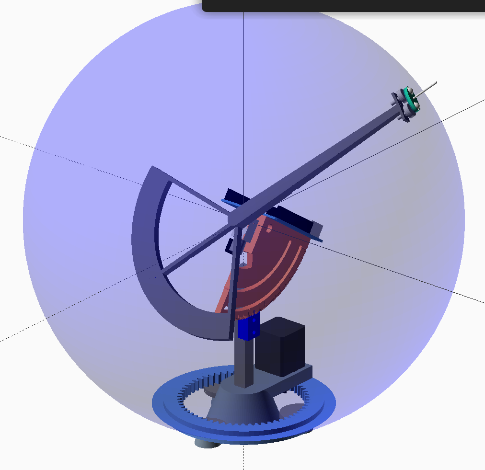

# Orbigator – An Analog Orbit Propagator

## About This Project

Orbigator is a small, open‑source device that physically demonstrates how a satellite orbits the Earth. It is inspired by traditional [orreries](https://en.wikipedia.org/wiki/Orrery), the clockwork models that use gears and arms to show the relative motion of the planets. Like an orrery, Orbigator is a mechanical model, but instead of showing the entire solar system it focuses on a single Earth‑orbiting object. It uses a microcontroller and precision servo motors to move a pointer around a real globe, so you can watch the ground track of your favorite satellite in real time.

The system computes orbital mechanics using Kepler's laws and J2 perturbation effects to determine the satellite's instantaneous position. By controlling two motors—one for the Equator crossing (LAN) and one for the Argument of Vehicle (AoV)—Orbigator accurately tracks orbital motion including precession effects.

## How It Works

At its core, Orbigator combines open hardware and open software:

- **Microcontroller and firmware** – A Raspberry Pi Pico 2 running MicroPython executes orbital mechanics calculations based on altitude and inclination parameters. The main control code is in `micropython/orbigator.py` and implements Kepler's third law plus J2 precession to compute motor rotation rates.

- **Mechanical actuation** – Two DYNAMIXEL XL330-M288-T servo motors provide precise positioning:
  - **EQX Motor (ID 1)**: Rotates the orbital plane via an 11-tooth drive gear to 120-tooth ring gear (10.909:1 ratio)
  - **AoV Motor (ID 2)**: Direct-drive positioning of the satellite pointer along the orbital path
  
  These motors use Extended Position Control Mode (Mode 4) for continuous multi-revolution tracking without rewinding.

- **Electrical interface** – The circuit uses a 74HC126 tri-state buffer for half-duplex UART communication with the DYNAMIXEL motors. Complete wiring diagrams are in `ORBIGATOR_PIN_ASSIGNMENTS.txt` and `ORBIGATOR_CIRCUIT_DIAGRAM.txt`. A KiCad-compatible netlist is provided in `orbigator_kicad_netlist.py`.

- **User interface** – An OLED display (SH1106/SSD1306) and rotary encoder allow interactive parameter adjustment. A DS3231 RTC maintains accurate timekeeping for orbital propagation.

### Example Assembly

*Oblique view of the assembled device.* The pointer arm holds a small model satellite at its tip and is mounted on a yellow base ring that sits on top of the globe.

*Side view showing the curved arm, motor housing and the large ring gear that allows the device to rotate around the globe's axis.*

*Fabrication drawing of the mount used to attach Orbigator to a globe. Dimensions are provided for reference when milling or 3D‑printing your own mount.*

## Repository Structure

| Directory | Contents |
|-----------|----------|
| `micropython/` | MicroPython firmware including `orbigator.py` (main control), `dynamixel_motor.py` (motor driver), and utility scripts |
| `fabricate/` | OpenSCAD source files for 3D printing mechanical components, including full assembly and individual parts |
| `schematics/` | SVG drawings of gears, motor mounts and the equatorial base used for fabrication |
| `images/` | Renderings and fabrication drawings used in this README |

## Key Documentation Files

- **`ORBIGATOR_PIN_ASSIGNMENTS.txt`** - Complete GPIO pin assignments for Pico 2
- **`ORBIGATOR_CIRCUIT_DIAGRAM.txt`** - ASCII circuit diagram showing all connections
- **`orbigator_kicad_netlist.py`** - KiCad-compatible netlist for schematic creation
- **`README_DYNAMIXEL_MOTORS.md`** - Quick start guide for DYNAMIXEL motor setup
- **`EXTENDED_POSITION_MODE_GUIDE.md`** - Best practices for Extended Position Mode
- **`pins.py`** - Python module with pin definitions for easy import

## Getting Started

1. **Review the wiring** - Start with `ORBIGATOR_PIN_ASSIGNMENTS.txt` for complete pin assignments
2. **Configure motor IDs** - Use `micropython/dynamixel_setup.py` to set motor IDs (1 for EQX, 2 for AoV)
3. **Upload firmware** - Copy `micropython/orbigator.py` and dependencies to your Pico 2
4. **Assemble mechanics** - 3D print parts from `fabricate/` directory
5. **Test and calibrate** - Run the interactive setup to configure orbital parameters

## Why Analog?

Learning about orbital mechanics can be abstract when done purely on a screen. Seeing a physical pointer sweep over a globe makes the concept tangible. By physically rotating around the Earth and adjusting position in real time, Orbigator offers an intuitive way to visualize how a satellite's orbit crosses different latitudes and longitudes. Traditional [orreries](https://en.wikipedia.org/wiki/Orrery) used gears and arms to show planetary motion; Orbigator applies the same mechanical principles to modern satellite tracking.

## Contributing

Contributions are welcome! Feel free to open issues or pull requests to improve the design, firmware or documentation. Ideas for supporting multiple satellites or automating TLE updates would be especially appreciated.

## License

This project is released under the MIT License. See LICENSE in the repository for details.
