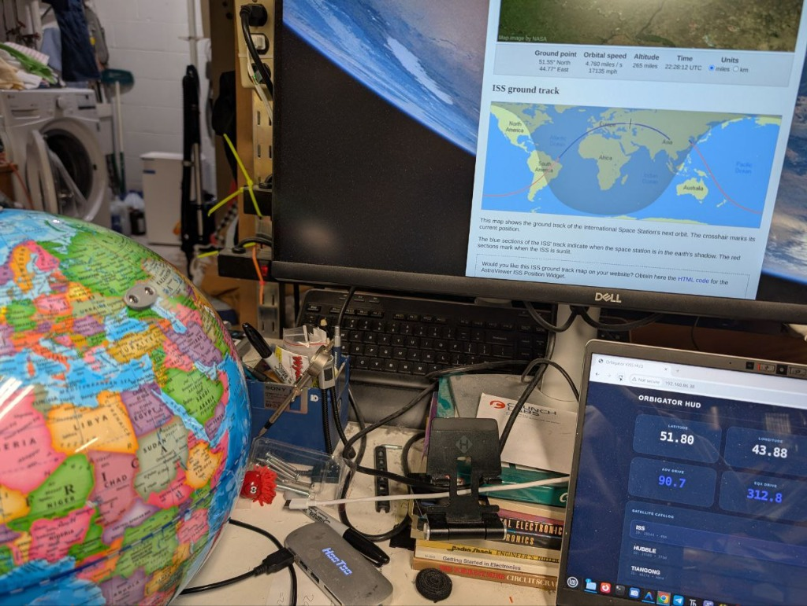
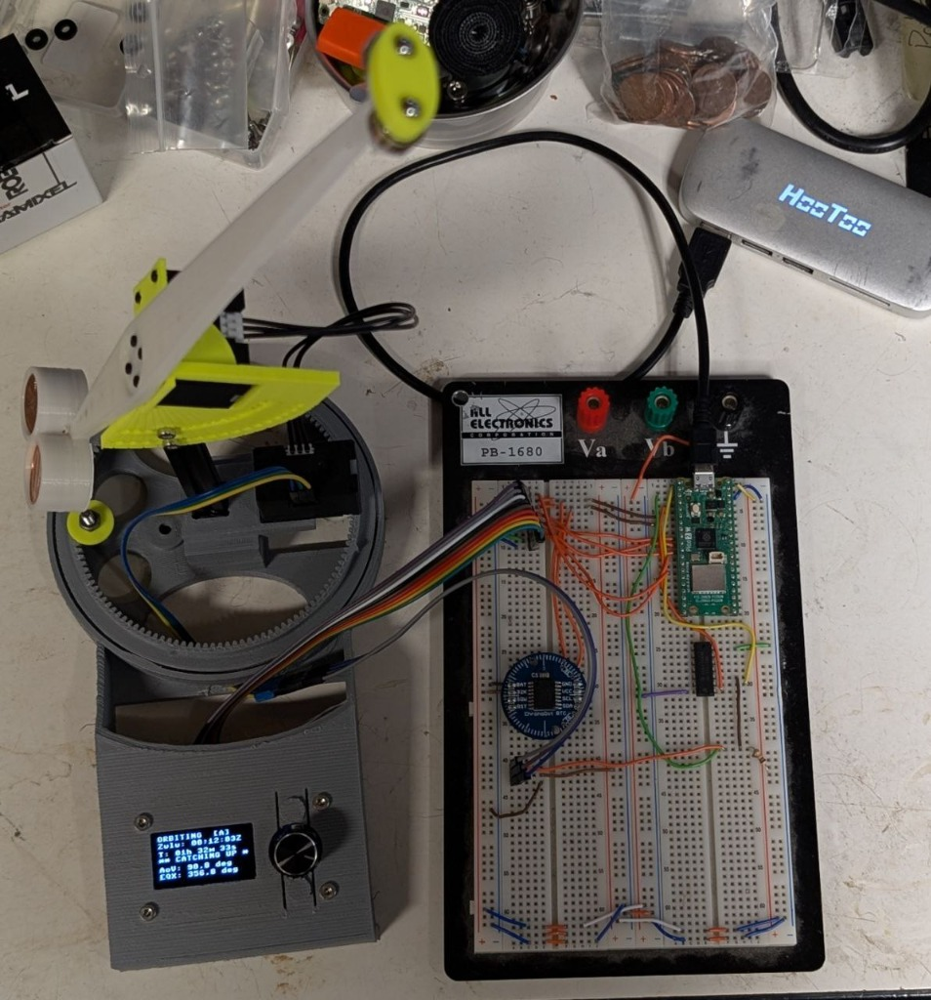

# Project Update: Precision, Stability, and the Path to a PCB

**The Orbigator is tracking smoother than ever.**

We’ve arguably reached the most significant milestone since we first spun the globe: **Trustworthy Precision**.

Here is a rundown of the latest sprint:

## 1. SGP4 Precision Fix
We identified and fixed a critical issue where 32-bit floating-point math on the microcontroller was causing ~5000km errors in satellite positioning. By refactoring our time calculations to use integer Unix timestamps, we’ve brought the error down to **~50-70km**—which, for a 13" globe, is effectively pinpoint accuracy.

## 2. Taming the Wobble
As we added mass to the arm (magnets, pennies for counterweight), the AOV motor developed a slight oscillation. We built a custom tuning tool (`tune_wobble.py`) to systematically test PID profiles under load.
*   **Winner**: A solid `P=600, D=0` profile.
*   **Result**: Smooth, stable movement even at slow speeds, with `speed_limit=2` ensuring we don't decouple the magnet.

## 3. Configuration Refactor
We’ve matured the codebase by extracting hardcoded constants into `orbigator_config.json`. You can now tweak PID gains, gear ratios, and speed limits without touching the Python code.

## 4. Manual Zeroing Tool
Real-world hardware gets bumped. We created `set_eqx_zero.py`, an interactive shell tool that lets you manually align the ring gear to the Prime Meridian and save the offset instantly. No more guessing or re-flashing.

## Next Steps: The Hardware Leap

The software core is solid. The prototyping wires have served us well, but it's time to make this reproducible.
I’m starting the collaboration with **Anool** and **Kevin** to design the official **Orbigator Control Board**. We’re moving from breadboards to a dedicated PCB that will house the Pico 2W, RTC, and motor interfaces in a clean, professional package.

Stay tuned. The orbit continues.
